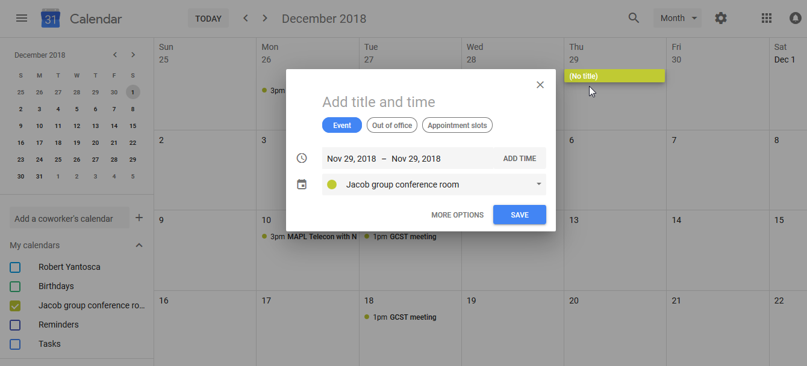

# Book a meeting in the Jacob Group Conference Room

We have created a Google calendar named **Jacob group conference room**, which is linked to the Jacob group email list
(`jacob-group@g.harvard.edu`). You can use this calendar to reserve the Jacob group conference room (Pierce 110E) for your research meetings and
telecons.

Permission to update the Jacob group conference room calendar is granted to all members of the Jacob group who:

1.  Have a valid `g.harvard.edu` email address, and
2.  Are subscribed to the Jacob group email list
    (`jacob-group@g.harvard.edu`)

If you are new to the Jacob group, then please contact Harvard University IT, who can set you up with a `g.harvard.edu` email address.
Then contact the GEOS-Chem Support Team, who can add you to the Jacob group email list.

## Adding events to the Jacob group conference room calendar

To reserve the conference room for a given date and time, simply add a
new event to the Jacob group conference room calendar:

**(1)** Log in to <https://calendar.google.com> with your
`g.harvard.edu` email address and password.

**(2)** Click on the date of your event. A popup box will ask you to add
an event title and time.

**(3)** Click on **More options** to further refine the event.

  - Add a **starting time** and **ending time** for your event.
  - Type **Jacob Group conference room (P110E)** in the location box.
  - IMPORTANT: Select the **Jacob group conference room** calendar.
      - The Google Calendar page will display all of your Google
        Calendars, as well as the Jacob group conference room calendar. 
      - This makes it very easy to place your event in the wrong
        calendar if you are not careful.
  - OPTIONAL: Add a description for your event in the **Add Description
    box**.
  - OPTIONAL: Invite other group members by typing their names in the
    **Add Guests** tab. Each guest will get an individual notification. 
      - Adding guests is not strictly necessary. Event notifications
        will be sent to the [Harvard ACMG Slack
        channel](/wiki/as/slack), which most group members can see.
  - Click **Save** to create the event.

\--- *GEOS-Chem Support Team 2018/11/15 16:55*

## Viewing the Jacob group conference room calendar

You can view events on the calendar in several ways.

### Viewing the calendar from the Jacob-group web site

You can find a read-only link to the Jacob group conference room
calendar on the front page of the Jacob group web site
(<http://acmg.seas.harvard.edu>):

Clicking on the link will display all events in month view by default.

Click on **Week** to display all of the events for the upcoming week
(not shown here).

Click on **Agenda** to display all events in a list format, as shown
below.

\--- *GEOS-Chem Support Team 2018/11/15 16:55*

### Viewing the calendar from Microsoft Outlook

You can configure your Microsoft Outlook to display the Jacob group
conference room calendar as follows:

**(1)** Log into Google Calendar (<https://calendar.google.com>) with
your `g.harvard.edu` email and password.

  - Right-click on the **Jacob group conference room** calendar, under
    the **My calendars** section.
  - This will pop up a context menu. Click on **Settings and sharing**.

**(2)** Scroll to the bottom of the page to the **Secret address in iCal
format** box.

  - Highlight the link with your mouse and copy it to your your
    clipboard.

**(3)** Go to your Microsoft Outlook desktop program.

  - Click on the **File** tab at top left.
  - Click on the **Account Settings** button.
  - Click on **Account Settings** from the drop-down menu.

**(4)** A dialog box with several tabs will pop up.

  - Click on the **Internet Calendars** tab.
  - Paste the link you copied from Google Calendar (**Secret address in
    iCal format**) in the box.
  - Click the **Add** button to synchronize the Jacob Group conference
    room calendar to your Microsoft Outlook.

**(5)** If the Jacob group conference room calendar is not automatically
displayed, then:

  - Click on the checkbox **Other calendars** in the left sidebar.
  - Click on the checkbox for **Jacob group conference room**. This will
    display the Jacob group conference room calendar next to your
    personal Outlook calendars.

\--- *\[GEOS-Chem Support Team 2018/11/15 16:56*

## Get notifications of Jacob group conference room events in Slack

We have synchronized the Jacob group conference room calendar with the
[Harvard ACMG channel on Slack](/wiki/as/slack)
(`harvard-acmg.slack.com`). Each time an event is added, deleted, or
updated in the Jacob group conference room calendar, a notification will
under the `#conference-room` tab in the Harvard ACMG Slack channel.

Notifications will also be posted here 15 minutes before each event is
scheduled to take place. A weekly digest of upcoming events will also be
sent to the `jacob-group@as.harvard.edu`

If you are not yet on the Harvard ACMG Slack Channel, then please
contact the GEOS-Chem Support Team at
`geos-chem-support@as.harvard.edu`, who will be happy to add you.

\--- *GEOS-Chem Support Team 2018/11/15 16:48*

## Return to Menu

  - [Go to Harvard Atmospheric Sciences Wiki Home](/start)
  - [Go to "The Basics" Menu](/wiki/basics)
  - [Go to Network Resources Menu](/wiki/computer_and_network_info)
